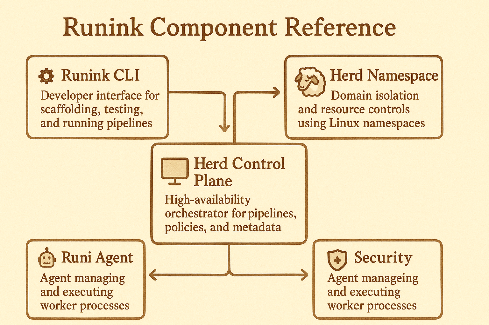
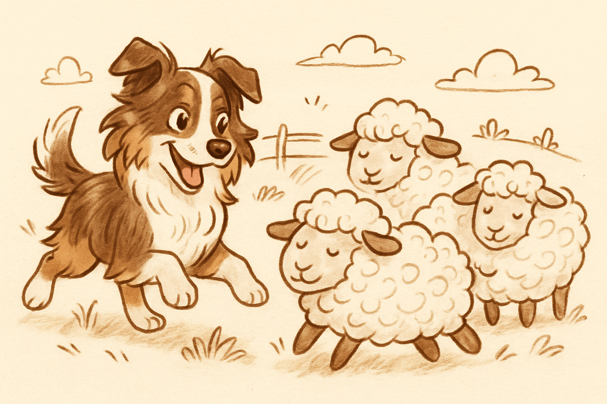
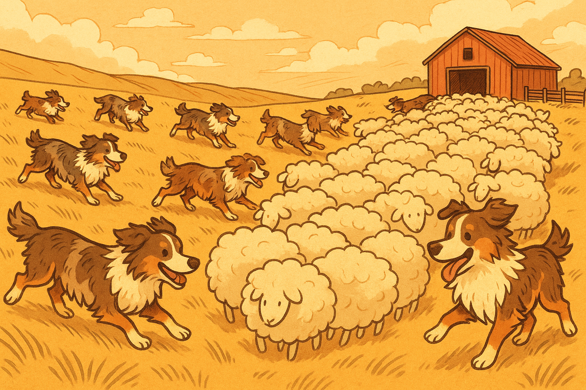

# Runink: Cloud Native Distributed Data Environment

[](https://example.com/build/status)
[](https://opensource.org/licenses/Apache-2.0)
[](https://goreportcard.com/report/github.com/your_org/runink)

---

## Overview

<table>
  <tr>
    <th></th>
    <th><h4>Runink is a Go-native distributed pipeline orchestration and governance platform.</h4></th>
  </tr>
</table>
<br>
<table>

***Runink*** is an ambitious project aiming to define a **self-sufficient, distributed environment** specifically designed for orchestrating and executing data pipelines. Built natively in **Go** and leveraging core **Linux primitives** (cgroups, namespaces, `exec`), Runink acts as its own cluster resource manager and scheduler, providing a vertically integrated platform that replaces the need for separate systems like Slurm or complex Kubernetes setups for data workloads.

Our goal is to provide a highly efficient, secure, and governance-aware platform with a **serverless execution model** for data engineers and scientists. Define your pipelines declaratively, and let Runink handle the distributed execution, isolation, resource management, security, lineage, and observability. It empowers you to:

- Define and manage Herds (namespaces and quotas)
- Write declarative DSL-based Features and Contracts
- Compile Features into executable DAGs
- Schedule isolated, secure slices with cgroups and namespaces
- Maintain strong metadata lineage, governance, and compliance

## Core Principles

* **Go Native & Linux Primitives:** Maximize performance and minimize overhead by using Go and direct Linux kernel features (cgroups, namespaces, pipes, sockets, `exec`).
* **Self-Contained Cluster Management:** Manages a pool of nodes, schedules workloads (`Runi Slices`), and handles node lifecycles.
* **Serverless Execution Model:** Users define pipelines; Runink manages resource allocation (within quotas), execution isolation (`Herds`/`Runi Slices`), and scaling.
* **Security First:** Integrated identity (OIDC), Role-Based Access Control (RBAC) scoped by `Herd`, secrets management, network policies via namespaces, and end-to-end encryption (TLS for gRPC).
* **Data Governance Aware:** Built-in metadata catalog, automatic data lineage tracking, data quality framework, and support for rich annotations (including LLM-generated metadata).
* **Rich Observability:** Native support for metrics (Prometheus format) and structured logs (for Fluentd aggregation).

## Key Features




* **Integrated Orchestration:** A built-in Control Plane parses DSLs into DAGs and schedules distributed execution across managed nodes.
* **Runi/Herd Execution Model:** Lightweight, isolated pipeline steps (`Runi Slices`) execute within resource-constrained cgroups and logically separated `Herd` namespaces for multi-tenancy and domain isolation.
* **Native Observability:** Components are instrumented for Prometheus metrics and structured logging out-of-the-box.
* **Native Data Governance & Lineage:** Automatic lineage tracking, integrated data catalog, quality rule management, and rich annotation support (incl. LLM outputs) via a central `Data Governance Service`.
* **Built-in Security:** Native RBAC, OIDC integration, secrets management, mTLS for internal communication, and namespace-based isolation.
* **Schema Contracts:** Define and enforce data structure guarantees throughout the pipeline lifecycle.


*(For more details, see [`docs/architecture.md`](./docs/architecture.md))*

## Key Concepts

---

<table>
  <tr>
    <th></th>
    <th><h4>The golang code base to deploy features from configurations files deployed by command actions over the CLI/API.</h4></th>
  </tr>
  <tr>
    <th>Runink</th>
    <th>DAG compiler from DSL + Contracts</th>
  </tr>
</table>
<br>
<table>
  <tr>
    <th></th>
    <th><h4>A single instance of a pipeline step running as an isolated <i>Runi Slice Process</i> managed by a <i>Runi Agent</i> within the constraints of a specific <i>Herd</i></h4></th>
  </tr>
  <tr>
    <th>Runi</th>
    <th>Agent lifecycle, slice scheduling and execution</th>
  </tr>
</table>
<br>
<table>
  <tr>
    <th></th>
    <th><h4>A logical grouping construct, similar to a Kubernetes Namespace, enforced via RBAC policies and resource quotas. Provides multi-tenancy and domain isolation.</h4></th>
  </tr>
  <tr>
    <th>Herd</th>
    <th>Metadata governance, lineage tracking</th>
  </tr>  
</table>
<table>
  <tr>
    <th></th>
    <th><h4>A distributed, Raft-backed state store that guarantees strong consistency, high availability, and deterministic orchestration. No split-brain, no guesswork — just fault-tolerant operations.</h4></th>
  </tr>
  <tr>
    <th>Barn</th>
    <th>Herds, secrets, registry control plane</th>
  </tr>  
</table>

<br>


## Getting Started

```bash
# Example (Conceptual)
runi herd init my-data-herd
runi compile \
  --scenario features/trade_cdm.dsl \
  --contract contracts/trade_cdm_multi.go \
  --out dags/trade_cdm_dag.go

runi synth \ 
  --scenario features/trade_cdm.dsl \
  --contract contracts/trade_cdm_multi.go \
  --golden cdm_trade_input.json

runi audit \ 
  --scenario features/trade_cdm.dsl \
  --contract contracts/trade_cdm_multi.go \
  --golden cdm_trade_input.json

runi status --runid RUN-20240424-XYZ --herd finance

runi run --dag dags/trade_cdm_dag.go 


```

Curious?

[Detailed Architecture →](./docs/architecture.md) | [Components Overview →](./docs/components.md) | [Comparison with other open-source projects →](./docs/benchmark/)

## Development Status

**Alpha / Conceptual:** Runink is currently under active development and should be considered experimental. The architecture and features described represent the target state.


## Contributing

Contributions are welcome\! Please read our [`docs/contributing.md`](./docs/contributing.md) guide for details on our code of conduct, and the process for submitting pull requests.

## License

This project is licensed under the Apache License 2.0 - see the [LICENSE](./LICENSE) file for details.
