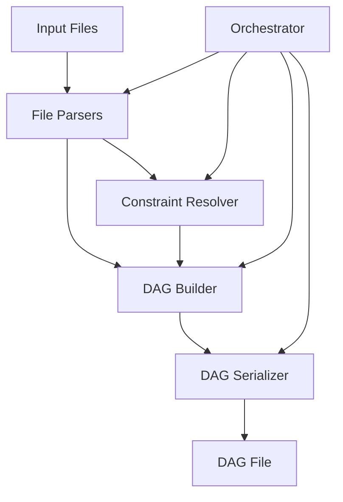
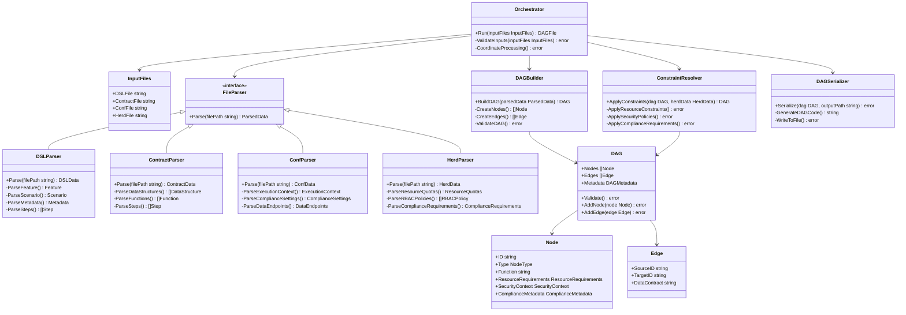
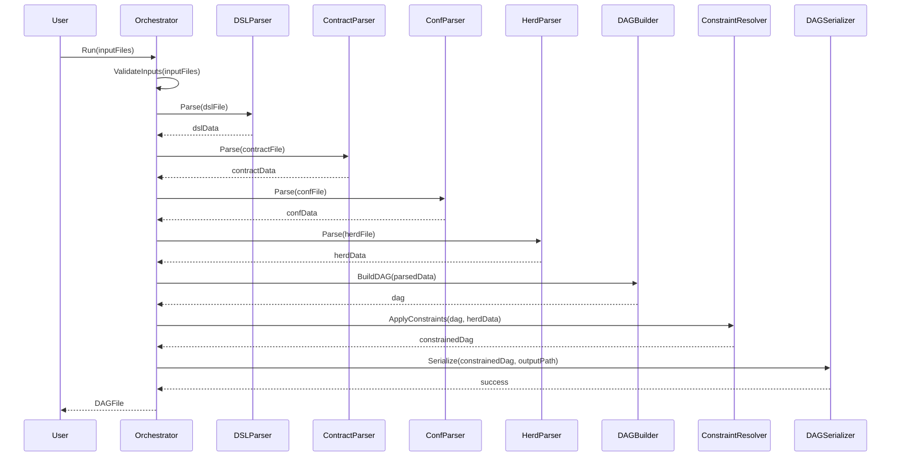

# RunInk DAG Generator Demo - Design Document

## 1. Introduction

This document outlines the architecture and design for a RunInk DAG (Directed Acyclic Graph) generator demo. The demo will take RunInk configuration files (DSL, contract, conf, and herd) as input and generate a corresponding DAG file according to RunInk architecture principles.

### 1.1 Purpose

The purpose of this demo is to showcase how RunInk's declarative pipeline definitions can be transformed into executable DAGs that represent data processing workflows. This transformation process is a key part of the RunInk architecture, enabling users to define pipelines in a human-readable format while ensuring they are executed efficiently and according to organizational policies.

### 1.2 Scope

The demo will:
- Parse and validate RunInk DSL, contract, conf, and herd files
- Extract pipeline definitions, processing steps, and configuration parameters
- Generate a DAG representation of the pipeline
- Serialize the DAG to a file format suitable for execution
- Apply functional programming principles throughout the implementation

## 2. System Architecture

### 2.1 High-Level Architecture

The RunInk DAG Generator Demo consists of the following major components:

1. **File Parsers**: Components responsible for parsing and validating the input files
2. **DAG Builder**: Component that constructs the DAG based on the parsed information
3. **Constraint Resolver**: Component that applies resource constraints and policies to the DAG
4. **DAG Serializer**: Component that outputs the DAG in a format suitable for execution
5. **Orchestrator**: Component that coordinates the overall process



### 2.2 Component Diagram



## 3. Component Details

### 3.1 File Parsers

#### 3.1.1 DSL Parser

The DSL Parser is responsible for parsing the Gherkin-like syntax of the DSL file and extracting the pipeline definition.

**Key Responsibilities:**
- Parse Feature and Scenario blocks
- Extract metadata including purpose, compliance requirements, and SLO targets
- Parse source and sink definitions
- Extract processing steps and their sequence
- Parse assertions and golden test specifications

**Implementation Approach:**
- Use a recursive descent parser to handle the hierarchical structure of the DSL
- Implement a state machine to track the current parsing context (Feature, Scenario, Given, When, Then)
- Use regular expressions to extract key-value pairs from metadata blocks
- Validate the DSL against a schema to ensure it's well-formed

**Data Structures:**
```go
type DSLData struct {
    Feature     string
    Scenario    string
    Metadata    map[string]string
    Source      SourceDefinition
    Steps       []StepDefinition
    Assertions  []AssertionDefinition
    GoldenTest  GoldenTestDefinition
    Notifications []NotificationDefinition
}

type SourceDefinition struct {
    Type        string
    Endpoint    string
    Format      string
    Parameters  map[string]string
}

type StepDefinition struct {
    Name        string
    Description string
    Function    string
    Parameters  map[string]string
}

type AssertionDefinition struct {
    Type        string
    Condition   string
    Message     string
}

type GoldenTestDefinition struct {
    InputPath   string
    OutputPath  string
}

type NotificationDefinition struct {
    Event       string
    Channel     string
    Message     string
}
```

#### 3.1.2 Contract Parser

The Contract Parser analyzes the Go contract file to identify data structures and functions that will be used in the DAG.

**Key Responsibilities:**
- Parse Go struct definitions and their field annotations
- Extract function definitions and their signatures
- Identify the processing steps defined in the contract
- Extract validation, masking, and compliance annotations

**Implementation Approach:**
- Use Go's AST (Abstract Syntax Tree) package to parse the Go source code
- Implement visitors to extract struct definitions, function signatures, and annotations
- Build a map of functions to their signatures for later use in the DAG

**Data Structures:**
```go
type ContractData struct {
    Name            string
    Version         string
    DataStructures  []DataStructure
    Functions       []Function
    Steps           []string
}

type DataStructure struct {
    Name        string
    Fields      []Field
    Annotations map[string]string
}

type Field struct {
    Name        string
    Type        string
    Tags        map[string]string
    Annotations map[string]string
}

type Function struct {
    Name        string
    Signature   string
    Description string
    Parameters  []Parameter
    ReturnType  string
}

type Parameter struct {
    Name        string
    Type        string
}
```

#### 3.1.3 Conf Parser

The Conf Parser loads and parses the configuration file to extract execution parameters, compliance requirements, and data endpoints.

**Key Responsibilities:**
- Parse contract definition including name, version, and schema hash
- Extract compliance settings for regulatory frameworks
- Parse execution context including herd, masking policy, and SLO targets
- Extract data source and sink configurations
- Parse testing, alerting, retention, and audit settings

**Implementation Approach:**
- Use a TOML or similar parser to handle the configuration file format
- Implement validation to ensure all required settings are present
- Build a structured representation of the configuration for use in the DAG

**Data Structures:**
```go
type ConfData struct {
    ContractDefinition  ContractDefinition
    ComplianceSettings  ComplianceSettings
    ExecutionContext    ExecutionContext
    DataEndpoints       DataEndpoints
    TestingConfig       TestingConfig
    AlertingRules       []AlertingRule
    RetentionPolicies   RetentionPolicies
    AuditSettings       AuditSettings
}

type ContractDefinition struct {
    Name        string
    Version     string
    SchemaHash  string
}

type ComplianceSettings struct {
    Frameworks  []string
    Policies    map[string]string
}

type ExecutionContext struct {
    Herd            string
    MaskingPolicy   string
    SLOTargets      map[string]string
}

type DataEndpoints struct {
    Sources     []DataEndpoint
    Sinks       []DataEndpoint
}

type DataEndpoint struct {
    Type        string
    Endpoint    string
    Format      string
    Parameters  map[string]string
}

type TestingConfig struct {
    GoldenTestPaths  []string
}

type AlertingRule struct {
    Event       string
    Channel     string
    Message     string
}

type RetentionPolicies struct {
    DataRetention    string
    LogRetention     string
}

type AuditSettings struct {
    AuditLevel      string
    AuditEndpoint   string
}
```

#### 3.1.4 Herd Parser

The Herd Parser extracts resource quotas, security policies, and compliance requirements from the herd file.

**Key Responsibilities:**
- Parse herd metadata including domain identification and description
- Extract resource quotas for CPU, memory, and storage
- Parse RBAC policies and security settings
- Extract compliance requirements and masking policies
- Parse runtime isolation and retention policies

**Implementation Approach:**
- Use a TOML or similar parser to handle the herd file format
- Implement validation to ensure all required settings are present
- Build a structured representation of the herd configuration for use in the DAG

**Data Structures:**
```go
type HerdData struct {
    Metadata                HerdMetadata
    Labels                  map[string]string
    ResourceQuotas          ResourceQuotas
    RBACPolicies            []RBACPolicy
    SecretsManagement       SecretsManagement
    ComplianceRequirements  ComplianceRequirements
    ObservabilityHooks      ObservabilityHooks
    ContractPolicies        ContractPolicies
    MaskingPolicies         []MaskingPolicy
    RuntimeIsolation        RuntimeIsolation
    RetentionAndAudit       RetentionAndAudit
}

type HerdMetadata struct {
    Name        string
    Description string
    Owner       string
}

type ResourceQuotas struct {
    CPU         string
    Memory      string
    Storage     string
}

type RBACPolicy struct {
    Role        string
    Resources   []string
    Verbs       []string
}

type SecretsManagement struct {
    EncryptionKey   string
    AccessPolicy    string
}

type ComplianceRequirements struct {
    Frameworks  []string
    Policies    map[string]string
}

type ObservabilityHooks struct {
    LogLevel        string
    MetricsEndpoint string
}

type ContractPolicies struct {
    ValidationLevel     string
    DriftDetection      string
}

type MaskingPolicy struct {
    Field       string
    Method      string
    Parameters  map[string]string
}

type RuntimeIsolation struct {
    NetworkPolicy   string
    SecurityContext string
}

type RetentionAndAudit struct {
    DataRetention    string
    AuditRetention   string
    AuditLevel       string
}
```

### 3.2 DAG Builder

The DAG Builder constructs a DAG representation with nodes and edges based on the parsed information from the input files.

**Key Responsibilities:**
- Create nodes for each processing step defined in the DSL and implemented in the contract
- Create source and sink nodes for data input and output
- Define edges between nodes based on the sequence defined in the DSL
- Validate the DAG to ensure it's well-formed with no cycles

**Implementation Approach:**
- Use a builder pattern to construct the DAG incrementally
- Implement validation to ensure the DAG is well-formed
- Use a topological sort to verify there are no cycles in the DAG

**Data Structures:**
```go
type DAG struct {
    Nodes       []Node
    Edges       []Edge
    Metadata    DAGMetadata
}

type Node struct {
    ID                      string
    Type                    NodeType
    Function                string
    InputContract           string
    OutputContract          string
    ResourceRequirements    ResourceRequirements
    SecurityContext         SecurityContext
    ComplianceMetadata      ComplianceMetadata
}

type NodeType string
const (
    SourceNode      NodeType = "source"
    ProcessingNode  NodeType = "processing"
    SinkNode        NodeType = "sink"
)

type Edge struct {
    SourceID    string
    TargetID    string
    DataContract string
}

type DAGMetadata struct {
    Name            string
    Description     string
    Version         string
    Herd            string
    ComplianceFrameworks []string
}

type ResourceRequirements struct {
    CPU         string
    Memory      string
    Storage     string
}

type SecurityContext struct {
    RunAsUser       string
    RunAsGroup      string
    AllowPrivileged bool
}

type ComplianceMetadata struct {
    Frameworks      []string
    DataClassification string
    RetentionPolicy string
}
```

### 3.3 Constraint Resolver

The Constraint Resolver applies resource constraints, security policies, and compliance requirements from the herd file to the DAG.

**Key Responsibilities:**
- Apply resource quotas to each node in the DAG
- Apply security policies and runtime isolation settings
- Apply compliance requirements and masking policies
- Validate that the DAG can be executed within the constraints of the herd

**Implementation Approach:**
- Implement a visitor pattern to traverse the DAG and apply constraints
- Use a constraint solver to ensure all constraints can be satisfied
- Implement validation to ensure the DAG can be executed within the constraints

**Data Structures:**
```go
type ConstraintResolver struct {
    HerdData    HerdData
}

type Constraint interface {
    Apply(node *Node) error
    Validate(node *Node) error
}

type ResourceConstraint struct {
    ResourceQuotas ResourceQuotas
}

type SecurityConstraint struct {
    RBACPolicies    []RBACPolicy
    RuntimeIsolation RuntimeIsolation
}

type ComplianceConstraint struct {
    ComplianceRequirements ComplianceRequirements
    MaskingPolicies        []MaskingPolicy
}
```

### 3.4 DAG Serializer

The DAG Serializer outputs the DAG in a format suitable for execution by the RunInk runtime.

**Key Responsibilities:**
- Generate Go code that represents the DAG
- Include all necessary imports and dependencies
- Write the DAG to a file

**Implementation Approach:**
- Use Go templates to generate the DAG code
- Implement a visitor pattern to traverse the DAG and generate code for each node
- Use Go's formatting package to ensure the generated code is well-formatted

**Data Structures:**
```go
type DAGSerializer struct {
    TemplateDir string
}

type DAGTemplate struct {
    DAG         DAG
    Imports     []string
    Package     string
}
```

### 3.5 Orchestrator

The Orchestrator coordinates the overall process of generating the DAG from the input files.

**Key Responsibilities:**
- Validate the input files
- Coordinate the parsing of the input files
- Coordinate the building of the DAG
- Coordinate the application of constraints
- Coordinate the serialization of the DAG

**Implementation Approach:**
- Implement a facade pattern to provide a simple interface to the complex subsystems
- Use a builder pattern to construct the DAG incrementally
- Implement validation at each step to ensure the process is proceeding correctly

**Data Structures:**
```go
type Orchestrator struct {
    DSLParser           DSLParser
    ContractParser      ContractParser
    ConfParser          ConfParser
    HerdParser          HerdParser
    DAGBuilder          DAGBuilder
    ConstraintResolver  ConstraintResolver
    DAGSerializer       DAGSerializer
}

type InputFiles struct {
    DSLFile      string
    ContractFile string
    ConfFile     string
    HerdFile     string
}

type ParsedData struct {
    DSLData      DSLData
    ContractData ContractData
    ConfData     ConfData
    HerdData     HerdData
}
```

## 4. Data Flow

The data flow through the system is as follows:

1. **Input Validation**:
   - The Orchestrator validates that all required input files exist and are accessible
   - The Orchestrator checks that the files have the correct format and structure

2. **File Parsing**:
   - The DSL Parser parses the DSL file to extract the pipeline definition
   - The Contract Parser parses the contract file to extract data structures and functions
   - The Conf Parser parses the conf file to extract execution parameters
   - The Herd Parser parses the herd file to extract resource quotas and policies

3. **DAG Building**:
   - The DAG Builder creates nodes for each processing step defined in the DSL
   - The DAG Builder creates source and sink nodes for data input and output
   - The DAG Builder defines edges between nodes based on the sequence defined in the DSL
   - The DAG Builder validates the DAG to ensure it's well-formed with no cycles

4. **Constraint Resolution**:
   - The Constraint Resolver applies resource quotas to each node in the DAG
   - The Constraint Resolver applies security policies and runtime isolation settings
   - The Constraint Resolver applies compliance requirements and masking policies
   - The Constraint Resolver validates that the DAG can be executed within the constraints of the herd

5. **DAG Serialization**:
   - The DAG Serializer generates Go code that represents the DAG
   - The DAG Serializer includes all necessary imports and dependencies
   - The DAG Serializer writes the DAG to a file



## 5. Parsing Strategies

### 5.1 DSL Parsing Strategy

The DSL file uses a Gherkin-like syntax with Feature, Scenario, Given, When, and Then blocks. The parsing strategy will be:

1. **Lexical Analysis**:
   - Tokenize the DSL file into lines
   - Identify block headers (Feature, Scenario, Given, When, Then)
   - Identify metadata blocks and key-value pairs

2. **Syntactic Analysis**:
   - Parse the Feature and Scenario blocks to extract the pipeline name and description
   - Parse the metadata block to extract configuration parameters
   - Parse the Given block to extract source definitions
   - Parse the When block to extract processing steps
   - Parse the Then block to extract sink definitions and assertions

3. **Semantic Analysis**:
   - Validate that all required blocks are present
   - Validate that the processing steps are defined in the correct order
   - Validate that the source and sink definitions are complete
   - Validate that the metadata contains all required parameters

### 5.2 Contract Parsing Strategy

The contract file is a Go source file with struct definitions, function signatures, and annotations. The parsing strategy will be:

1. **AST Parsing**:
   - Use Go's AST package to parse the Go source code
   - Identify struct definitions and their fields
   - Identify function definitions and their signatures
   - Identify annotations and tags

2. **Struct Analysis**:
   - Extract field names, types, and tags
   - Extract validation, masking, and compliance annotations
   - Build a map of struct names to their definitions

3. **Function Analysis**:
   - Extract function names, signatures, and descriptions
   - Identify the processing steps defined in the contract
   - Build a map of function names to their signatures

### 5.3 Conf Parsing Strategy

The conf file uses a TOML-like syntax with sections and key-value pairs. The parsing strategy will be:

1. **Section Identification**:
   - Identify section headers (e.g., `[contract]`, `[compliance]`)
   - Extract key-value pairs within each section

2. **Parameter Extraction**:
   - Extract contract definition parameters
   - Extract compliance settings
   - Extract execution context parameters
   - Extract data endpoint configurations
   - Extract testing, alerting, retention, and audit settings

3. **Validation**:
   - Validate that all required sections are present
   - Validate that all required parameters are present within each section
   - Validate that parameter values are of the correct type and format

### 5.4 Herd Parsing Strategy

The herd file uses a TOML-like syntax with nested sections and arrays of tables. The parsing strategy will be:

1. **Section Identification**:
   - Identify section headers (e.g., `[metadata]`, `[resource_quotas]`)
   - Extract key-value pairs within each section
   - Identify arrays of tables (e.g., `[[rbac_policies]]`)

2. **Parameter Extraction**:
   - Extract herd metadata
   - Extract resource quotas
   - Extract RBAC policies
   - Extract compliance requirements
   - Extract masking policies
   - Extract runtime isolation settings
   - Extract retention and audit policies

3. **Validation**:
   - Validate that all required sections are present
   - Validate that all required parameters are present within each section
   - Validate that parameter values are of the correct type and format

## 6. DAG Generation Algorithm

The DAG generation algorithm will transform the parsed information from the input files into a DAG representation. The algorithm will:

1. **Create Source Nodes**:
   - For each source defined in the DSL, create a source node
   - Set the node type to "source"
   - Set the output contract based on the source definition

2. **Create Processing Nodes**:
   - For each processing step defined in the DSL, create a processing node
   - Set the node type to "processing"
   - Set the function based on the step definition
   - Set the input and output contracts based on the function signature

3. **Create Sink Nodes**:
   - For each sink defined in the DSL, create a sink node
   - Set the node type to "sink"
   - Set the input contract based on the sink definition

4. **Create Edges**:
   - For each pair of adjacent nodes in the processing sequence, create an edge
   - Set the source ID to the ID of the first node
   - Set the target ID to the ID of the second node
   - Set the data contract based on the output contract of the source node

5. **Apply Constraints**:
   - For each node, apply resource constraints based on the herd file
   - For each node, apply security policies based on the herd file
   - For each node, apply compliance requirements based on the herd file

6. **Validate the DAG**:
   - Ensure the DAG is well-formed with no cycles
   - Ensure all nodes have the required properties
   - Ensure all edges have the required properties
   - Ensure the DAG can be executed within the constraints of the herd

7. **Generate DAG Code**:
   - Generate Go code that represents the DAG
   - Include all necessary imports and dependencies
   - Include the DAG metadata
   - Include the node and edge definitions
   - Include the constraint definitions

## 7. Functional Programming Principles

The implementation of the RunInk DAG Generator Demo will follow the functional programming principles outlined in the functional excellence reference document:

### 7.1 Pure Functions

All components will be implemented as pure functions that map inputs to outputs without side effects. This will enable:

- **Testability**: Each component can be tested in isolation with golden file testing
- **Concurrency**: Components can be executed concurrently without shared state
- **Idempotence**: The same inputs will always produce the same outputs

Example:
```go
// Pure function to parse a DSL file
func ParseDSL(dslContent string) (DSLData, error) {
    // Parse the DSL content and return a structured representation
    // No side effects, no mutation of external state
}
```

### 7.2 Data-Oriented Design

The implementation will prioritize memory predictability, cache locality, and low-GC pressure by:

- Using flat structs with minimal pointer chasing
- Preallocating slices based on known sizes
- Using sync.Pool for object reuse
- Avoiding unnecessary allocations

Example:
```go
// Preallocate slices for better memory efficiency
func ParseSteps(lines []string) []StepDefinition {
    steps := make([]StepDefinition, 0, len(lines))
    for _, line := range lines {
        // Parse the line and append to the steps slice
    }
    return steps
}
```

### 7.3 Zero-Copy and Streaming Pipelines

The implementation will process data as it flows, without materializing full datasets, by:

- Using io.Reader and io.Writer interfaces for streaming
- Using os.Pipe for inter-component communication
- Implementing backpressure control
- Processing data incrementally

Example:
```go
// Process data as it flows through the pipeline
func ProcessDSL(r io.Reader, w io.Writer) error {
    scanner := bufio.NewScanner(r)
    for scanner.Scan() {
        line := scanner.Text()
        // Process the line
        fmt.Fprintln(w, processedLine)
    }
    return scanner.Err()
}
```

### 7.4 Declarative Scheduling

The implementation will specify resource needs and constraints declaratively, rather than using imperative instructions, by:

- Capturing constraints in structured data
- Solving placement based on constraints
- Persisting decisions for replayability

Example:
```go
// Declarative constraint definition
type ResourceConstraint struct {
    CPU     string
    Memory  string
    Storage string
}

// Apply constraints to a node
func ApplyResourceConstraint(node *Node, constraint ResourceConstraint) error {
    node.ResourceRequirements.CPU = constraint.CPU
    node.ResourceRequirements.Memory = constraint.Memory
    node.ResourceRequirements.Storage = constraint.Storage
    return nil
}
```

## 8. Implementation Plan

The implementation of the RunInk DAG Generator Demo will proceed in the following phases:

### 8.1 Phase 1: File Parsers

1. Implement the DSL Parser
2. Implement the Contract Parser
3. Implement the Conf Parser
4. Implement the Herd Parser
5. Test each parser with sample files

### 8.2 Phase 2: DAG Builder

1. Implement the DAG data structures
2. Implement the DAG Builder
3. Implement the DAG validation
4. Test the DAG Builder with sample parsed data

### 8.3 Phase 3: Constraint Resolver

1. Implement the Constraint data structures
2. Implement the Constraint Resolver
3. Implement the constraint validation
4. Test the Constraint Resolver with sample DAGs

### 8.4 Phase 4: DAG Serializer

1. Implement the DAG Serializer
2. Implement the code generation templates
3. Test the DAG Serializer with sample DAGs

### 8.5 Phase 5: Orchestrator

1. Implement the Orchestrator
2. Implement the input validation
3. Implement the coordination logic
4. Test the Orchestrator with sample input files

### 8.6 Phase 6: Integration and Testing

1. Integrate all components
2. Implement end-to-end tests
3. Test with the provided sample files
4. Optimize performance and memory usage

## 9. Conclusion

The RunInk DAG Generator Demo will showcase how RunInk's declarative pipeline definitions can be transformed into executable DAGs. By following functional programming principles and implementing a modular, composable architecture, the demo will provide a solid foundation for understanding and extending the RunInk platform.

The demo will take DSL, contract, conf, and herd files as input and generate a corresponding DAG file that represents a data processing pipeline. The DAG will include nodes for each processing step, edges representing data flow, and constraints for resource allocation and security policies.

By implementing this demo, we will gain a deeper understanding of the RunInk architecture and how its components work together to provide a powerful platform for data pipeline orchestration and governance.
